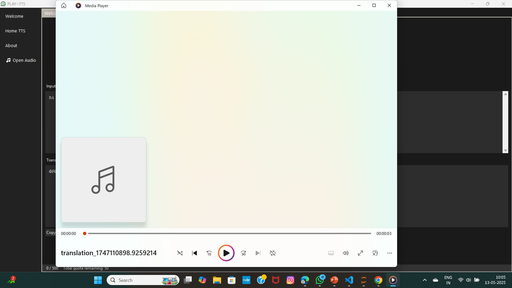

# The English To Multilingual TTS with AI Autocomplete

This project implements **Sentence Auto-Completion** using **LSTM** (Long Short-Term Memory) neural networks, alongside **Language Translation** and **Text-to-Speech (TTS)** functionalities. The goal is to predict and complete sentences based on input text and translate between languages (e.g., Tamil and English). Additionally, the generated text is converted into speech using a TTS model.

## Features

- **Sentence Auto-Completion** using LSTM for sequence prediction.
- **Language Translation** using an Encoder-Decoder model for translating between languages (e.g., Tamil and English).
- **Text-to-Speech (TTS)** to convert text into audible speech.
- Trained on **Holmes.txt** dataset (Sherlock Holmes stories) for auto-completion tasks.
- Implemented in a Jupyter Notebook (.ipynb).

## Dataset

The dataset used for training the Sentence Auto-Completion model is the **Holmes.txt** dataset, available on Kaggle. You can download it from the following link:

- [Holmes.txt Dataset on Kaggle](https://www.kaggle.com/datasets/arthurtok/holmes-text)

## Sample Outputs

### 🔸 Sentence Auto-Completion Example


### 🔸 Training  and Validation Accuracy 


### 🔸 Text to Text Translation 


### 🔸 Text-to-Speech Audio Playback Interface


### 🔸 Error Handlings


### 🔸 PLAY~tts [DESKTOP APP]





## Requirements

To run this project, make sure you have the following installed:

- Python 3.x
- TensorFlow/Keras
- NumPy, Pandas
- NLTK/Tokenizer
- gTTS (Google Text-to-Speech)
- Jupyter Notebook

You can install the required libraries using pip:

```bash
pip install tensorflow numpy pandas googletrans gtts mutagen matplotlib pydub pygame simpleaudio socket 
